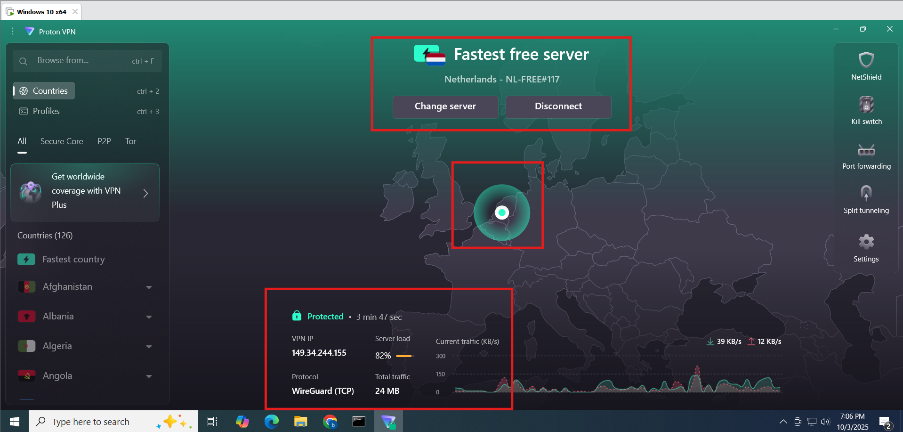
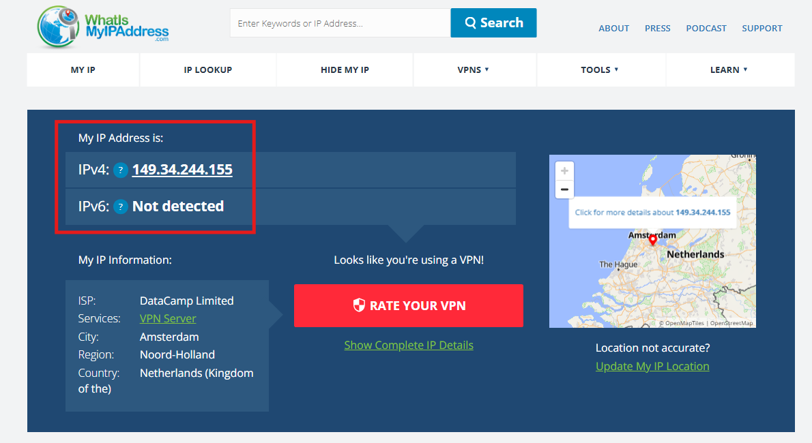

# VPN Setup & Privacy

# 🔹What is a VPN?

VPN stands for **Virtual Private Network**.

- It creates a **secure, encrypted tunnel** between your device and the internet.
- It **hides your IP address and location**.
- It protects your online activity from hackers, ISPs, and trackers.
- Commonly used for privacy, security, and bypassing restrictions.

**Example:** Using a VPN, someone in India can securely connect to a server in the U.S. and browse as if they were in the U.S.

---

## 🛠 Tools You Can Use
- [ProtonVPN Free](https://protonvpn.com/free-vpn)  
- [Windscribe Free](https://windscribe.com/)  
- [whatismyipaddress.com](https://whatismyipaddress.com) – to check your IP before/after VPN.  

---

## 🚀 Steps – Install & Use VPN

### 🔹 On Windows
1. **Download VPN Client**
   - Go to [ProtonVPN Downloads](https://protonvpn.com/download).  
   - Download the Windows installer.  

2. **Install VPN**
   - Run the installer → Accept terms → Complete setup.  

3. **Sign In**
   - Open ProtonVPN → Log in with your account.  

4. **Connect to a VPN Server**
   - Choose a free server (closer servers usually give better speed).  
   - Click **Connect**.

     

5. **Verify Connection**
   - Visit [whatismyipaddress.com](https://whatismyipaddress.com).  
   - Confirm your IP has changed.

     

6. **Disconnect & Test**
   - Disconnect VPN → Compare browsing speed and IP difference.
  
   

